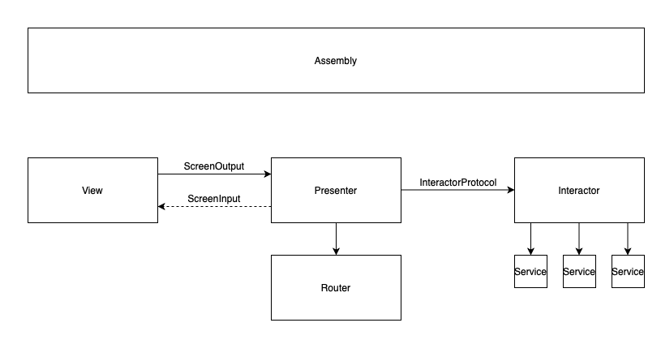
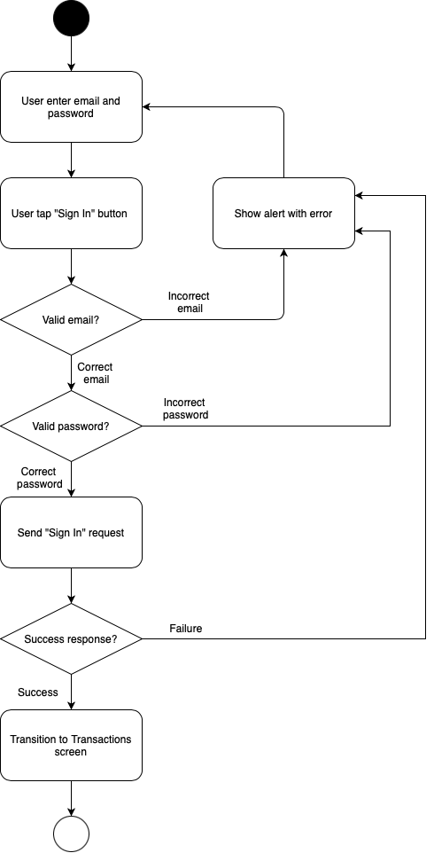
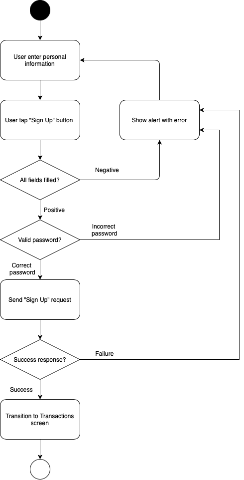
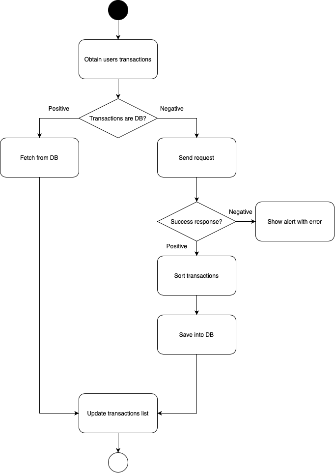

# PayDay

- Project name: PayDay
- Language: Swift 5
- Design pattern: VIPER
- Not use 3rd parties libraries

## Design pattern

I chose ```VIPER``` for several reasons. This pattern has a clear structure, with a division of responsibilities. Allows you to easily extend, maintain, and test your application. Provides the ability to reuse modules. If necessary, you can replace different module components. In this example, I used routers for navigation, but the coordinator pattern is better. Since it makes it possible to connect several flows into one chain, thereby dividing the context between them.



## User Stories

Implemented 3 of 4 user stories: <br />
✅ Sign In<br />
✅ Sign Up<br />
✅ Transactions<br />
❌ Monthly Dashboard<br />

Below you could see the flow diagrams for implemented user stories:

#### Sign in:

#### Sign up:

#### Transactions:


## Questions
1. I spent two days on the task. Due to lack of time, the design is badly implemented, there are small amount of validations, few notoriously bad quick fixes and not done monthly dashboard. Improvements propose:
-  assets, localization, colors generation through ```SwiftGen```
-  network layer generation via ```Alamofire``` + ```Swagger```
-  navigation through coordinators
-  design system with a single base of fonts, colors, indents
-  general ```ListAdapter``` for working with collections
-  dividing the application into modules / product teams
2. ```SwiftUI``` is a cool thing. I tried to show a few tricks from there, such as creating layout using stack and builders, or using decorators for ```UIView```. 
3. We can use analytical services for this. Or use the basic organizer that comes with ```Xcode```. 
4. The best thing is to do competent logging, and make it a cult of the team. Also, you can use third-party software such as ```Postman```, for example. Cover network layer by unit test be a good thing.
5. Style consistency is not used for API. The password is not sent in encrypted form. The backend does not provide any tools for field validation. Frontend shouldn't do sorting. Use ```HTTPS``` instead of ```HTTP```. Transaction API doesn't have pagination.
